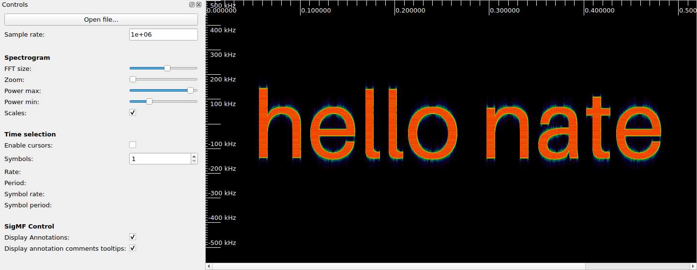

# pic2iq

Convert an image into complex I/Q samples, written as a [SigMF](https://sigmf.org)
recording, whose spectrogram shows the image.



## Install

```sh
pip install .
```

## Usage

```sh
pic2iq picture.png out/picture          # writes out/picture.sigmf-{meta,data}
pic2iq --text "hello nate" --font-size 192 out/hello_nate
inspectrum out/hello_nate.sigmf-meta
```

| option | default | meaning |
| --- | --- | --- |
| `--fft-size` | 512 | FFT size the image is designed for; image is scaled to this many rows |
| `--samples-per-column` | FFT size | samples per image column (FFT size gives square pixels in inspectrum at zoom 1) |
| `--sample-rate` / `--center-freq` | 1e6 / 0 | SigMF metadata |
| `--dynamic-range` | 60 | dB between black and white pixels |
| `--level` | 0 | dBFS of a white pixel's tone |
| `--orientation` | `inspectrum` | `inspectrum`: time left→right, frequency up; `waterfall`: time top→bottom, frequency right |
| `--iterations` | 32 | Griffin-Lim phase refinement iterations |

The defaults match inspectrum's default view (FFT size 512, zoom 1).
See [docs/method.md](docs/method.md) for how it works and how to render
screenshots headlessly.
